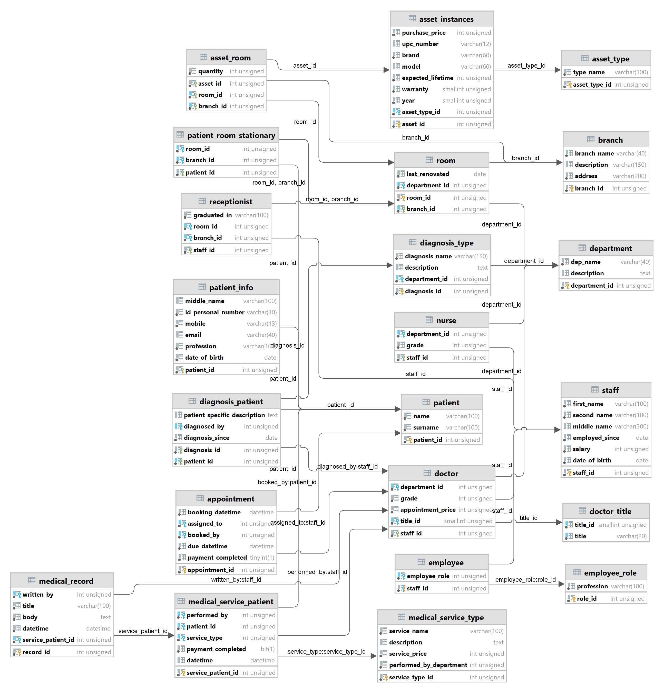
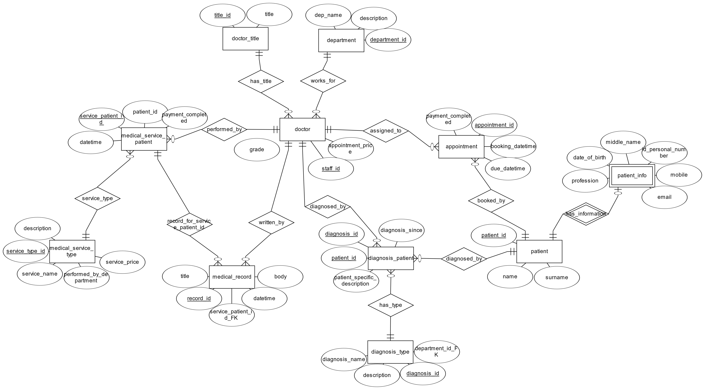
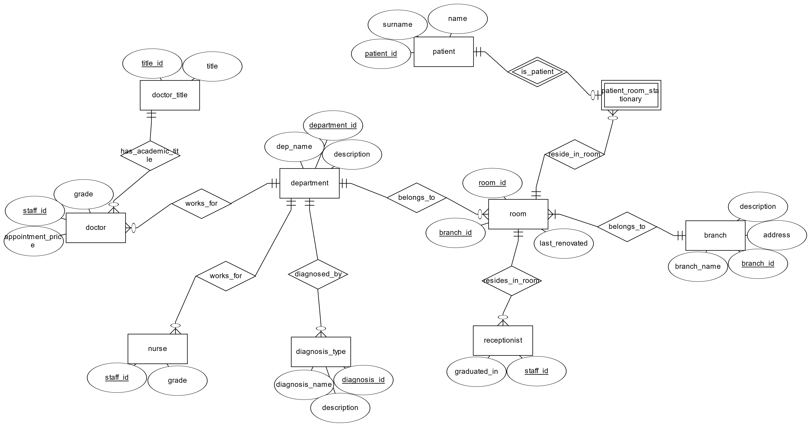

# hospital-db
In this project, we develop a database management system for a private hospital. Hospital databases are a critical component for the digital management of a hospital. They contain sensitive information about patients, as well as organizational information for the staff or hospital assets.

A well-designed database system can be helpful in building a management software that can be used by the receptionists, doctors and nurses of the hospital. It can help them keep track of appointments, tasks, stationary patients, medical records and payments. The database can also be used to build a future online presence for the hospital, so that patients book appointments with doctors.

The project contains:
-	22 entities, including 6 weak entities and 1 associative entity
-	28 relationships

Read [HospitalDatabase.pdf](HospitalDatabase.pdf) for more details.

## Unified Modelling Language (UML)

## Entity Relationship Diagrams (ERD)

#### Staff

#### Doctor

#### Department

#### Assets

